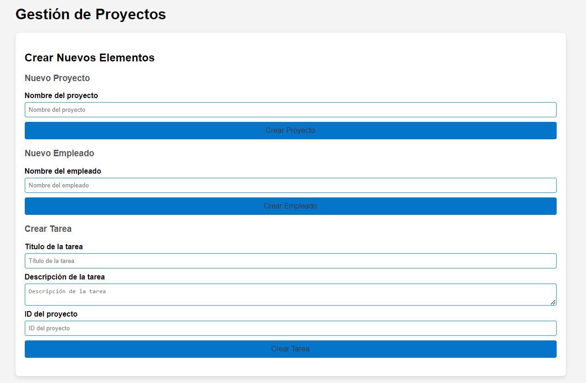
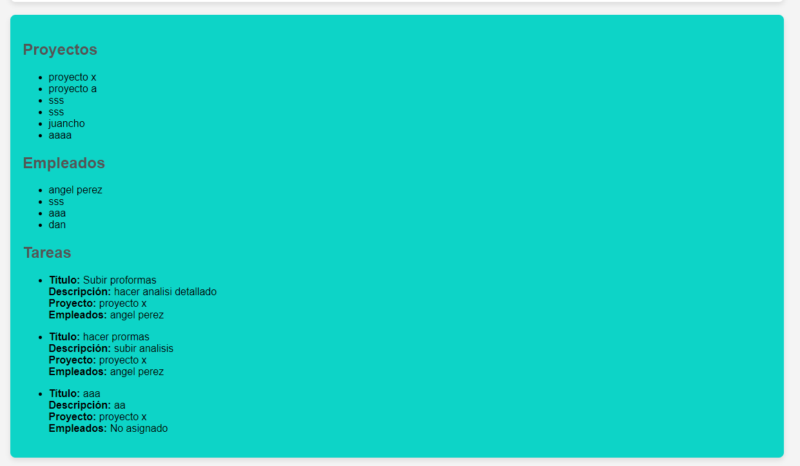

Gestión de Proyectos 

Este proyecto es una aplicación React que utiliza Apollo Client para interactuar con una API GraphQL. Permite crear y gestionar proyectos, empleados y tareas, así como asignar empleados a tareas específicas. A continuación se describe el funcionamiento y las características principales del proyecto.

Características
Crear Proyectos: Permite crear nuevos proyectos proporcionando un nombre.
Crear Empleados: Permite agregar nuevos empleados con un nombre.
Crear Tareas: Permite crear tareas asociadas a proyectos específicos con un título y una descripción.
Asignar Empleados a Tareas: Permite asignar empleados a tareas creadas previamente.

Instalación
Clonar el repositorio:

bash
Copiar código
git clone <URL del repositorio>
cd <nombre del repositorio>
Instalar dependencias:

bash
Copiar código
npm install
Configurar Apollo Client: Asegúrate de configurar correctamente el cliente Apollo con la URL de tu servidor GraphQL. Puedes ajustar esta configuración en el archivo src/apolloClient.js.

Iniciar el servidor:

bash
Copiar código
npm start
Uso
Crear Nuevos Proyectos:

Navega a la sección "Nuevo Proyecto".
Ingresa el nombre del proyecto y envía el formulario para crear un nuevo proyecto.
Agregar Nuevos Empleados:

Navega a la sección "Nuevo Empleado".
Ingresa el nombre del empleado y envía el formulario para agregar un nuevo empleado.
Crear Nuevas Tareas:

Navega a la sección "Crear Tarea".
Ingresa el título y la descripción de la tarea, así como el ID del proyecto al que pertenece, y envía el formulario para crear una nueva tarea.
Asignar Empleados a Tareas:

Después de crear una tarea, navega a la sección "Asignar Empleado a Tarea".
Selecciona el empleado y envía el formulario para asignar el empleado a la tarea correspondiente.
Consultas y Mutaciones GraphQL
Consultar Empleados:

graphql
Copiar código
query ObtenerEmpleados {
  empleados {
    id
    nombre
  }
}
Mutaciones:

Crear Proyecto:

graphql
Copiar código
mutation CrearProyecto($nombre: String!) {
  crearProyecto(nombre: $nombre) {
    id
    nombre
  }
}
Crear Empleado:

graphql
Copiar código
mutation CrearEmpleado($nombre: String!) {
  crearEmpleado(nombre: $nombre) {
    id
    nombre
  }
}
Crear Tarea:

graphql
Copiar código
mutation CrearTarea($titulo: String!, $descripcion: String, $proyectoId: ID!) {
  crearTarea(titulo: $titulo, descripcion: $descripcion, proyectoId: $proyectoId) {
    id
    titulo
    descripcion
    proyecto {
      id
      nombre
    }
  }
}
Asignar Empleado a Tarea:

graphql
Copiar código
mutation AsignarEmpleadoATarea($tareaId: ID!, $empleadoId: ID!) {
  asignarEmpleadoATarea(tareaId: $tareaId, empleadoId: $empleadoId) {
    id
    titulo
    descripcion
    empleados {
      id
      nombre
    }
  }
}

